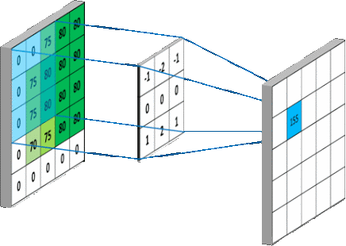

<div id="top"></div>
<!--
*** Thanks for checking out the Best-README-Template. If you have a suggestion
*** that would make this better, please fork the repo and create a pull request
*** or simply open an issue with the tag "enhancement".
*** Don't forget to give the project a star!
*** Thanks again! Now go create something AMAZING! :D
-->


<!-- PROJECT SHIELDS -->
<!--
*** I'm using markdown "reference style" links for readability.
*** Reference links are enclosed in brackets [ ] instead of parentheses ( ).
*** See the bottom of this document for the declaration of the reference variables
*** for contributors-url, forks-url, etc. This is an optional, concise syntax you may use.
*** https://www.markdownguide.org/basic-syntax/#reference-style-links
-->
<!-- [![Contributors][contributors-shield]][contributors-url]
[![Forks][forks-shield]][forks-url]
[![Stargazers][stars-shield]][stars-url] 
[![LinkedIn][linkedin-shield]][linkedin-url]
-->
[![Issues][issues-shield]][issues-url]
[![MIT License][license-shield]][license-url]


<!-- PROJECT LOGO -->
<br />
<div align="center">
  <a href="https://github.com/Bhartendu-Kumar/DIP">
    
  </a>
  
  
 
<h3 align="center">Exploring Blind Preprocessing to Improve Viola-Jones</h3>

  <p align="center">
    We are interested in studying the impact of applying various pre-processing methods on the detection efficiency of Viola-Jones detector. The pre-processing has to be blind so to be applied in all scenarios and still we do get better performance. 
    <br />
    <a href="https://github.com/Bhartendu-Kumar/DIP"><strong>Explore the docs »</strong></a>
    <br />
    <br />
    <a href="https://github.com/Bhartendu-Kumar/DIP">View Demo</a>
    ·
    <a href="https://github.com/Bhartendu-Kumar/DIP">Report Bug</a>
    ·
    <a href="https://github.com/Bhartendu-Kumar/DIP">Request Feature</a>
  </p>
</div>


   
    


<!-- TABLE OF CONTENTS -->
<details>
  <summary>Table of Contents</summary>
  <ol>
    <li>
      <a href="#Introduction">Introduction 
</a>
      <ul>
        <li><a href="#Pre-Processing-Algorithms">Pre-Processing-Algorithms</a></li>
        <li><a href="#Data-Sets">Data-Sets</a></li>
      </ul>
    </li>
    <li>
      <a href="#getting-started">Getting Started</a>
      <ul>
        <li><a href="#prerequisites">Prerequisites</a></li>
        <li><a href="#installation">Installation</a></li>
      </ul>
    </li>
    <li><a href="#usage">Usage</a></li>
    <li><a href="#roadmap">Analysis</a></li>
      <ul>
        <li><a href="#prerequisites">Observations</a></li>
        <li><a href="#installation">Results</a></li>
        <li><a href="#installation">Conclusions</a></li>
      </ul>
    <li><a href="#contributing">Contributing</a></li>
    <li><a href="#license">License</a></li>
    <li><a href="#contact">Contact</a></li>
    <li><a href="#acknowledgments">Acknowledgments</a></li>
  </ol>
</details>


<a id ="Introduction"></a>
<!-- Introduction -->
## Introduction

[![Product Name Screen Shot][product-screenshot]](https://example.com)


Viola-Jones Detector is an object detection Algorithm (which was originally developed for detecting faces. We are trying to increase (possibly ::exclamation:)  the detection efficiency by applying some pre-processing to images. Thus our **GOAL** is to study the impact of difference pre-processing algos to the viola jones detector.
  `Bhartendu-Kumar`, `DIP`, `twitter_handle`, `linkedin_username`, `email`, `email_client`, `project_title`, `project_description`

<p align="right">(<a href="#top">back to top</a>)</p>


<a id ="#Pre-Processing-Algorithms"> </a>
### Pre-Processing-Algorithms

----------------------------------------------------------------------------------------
#### I. Lightning Invarient / Intensity Normalization:
* [Retinex Methods](https://github.com/Bhartendu-Kumar/DIP/blob/main/scripts/retinex.py) 

1. SSR (single scale retinex) 
*we want to see if there is good sigma value (gaussian kernel)*
2. MSR (multi scale retinex)
	*to find list of sigmas*
3. Frankle-McCann Retinex
(*in build* : `Adaptive SSR` ) 
* [Non Local Means Methods](https://github.com/Bhartendu-Kumar/DIP/blob/main/scripts/nmbm.py) 
4. NMBM 
*to estimate best patch size , h , patch distance*
* [Normalization Methods](https://github.com/Bhartendu-Kumar/DIP/blob/main/scripts/homo.py) 


5. HOMO (homo morphic filtering)
*to estimate cutoff frequency*
(*in build* : `LSSF (Large Scale Small Scale Feature Illumination Normalization` ) 

* [Histogram Distribution Functions](https://github.com/Bhartendu-Kumar/DIP/blob/main/scripts/hist_eq.py) 


6. CLAHE
*to get best clip limit*
7. HE
8. log intensity stretch
9. full scale intensity stretch
#### II. Deconvolutions / Convolutions: 


10.  [Blind Deconvolution (richardson lucy)](https://github.com/Bhartendu-Kumar/DIP/blob/main/scripts/scikit_image_algorithms.py)
(*in build* : `Blind Motion Deblurring` ) 

* [Denoising](https://github.com/Bhartendu-Kumar/DIP/blob/main/scripts/scikit_image_algorithms.py) 
11.  Total-variation denoising (tv chambolle)
*to get the best weight parameter*
(*in build* : `tv bregman` ) 
12. gaussian blur
*best sigma and kernel size*
13. bilateral filter 
estimate spatial and luminance sigmas 


 


----------------------------------------------------------------------------------------

<a id ="#Data-Sets"> </a>
### Data-Sets

----------------------------------------------------------------------------------------
#### I. Face - Data Sets:


1. BioID
2. Yale
3. MIT-CBCL
4. NMBM 
5. Caltech Face
6. Orl
7. SoF
#### II. Non-Face - Data Sets:
1. airplane  
2. car  
3. cat  
4. dog  
5. flower  
6. forest  
7. fruit  
8. motorbike
(*an illustration of dataset is in dir [data]https://github.com/Bhartendu-Kumar/DIP/tree/main/data)* : `make your data folder of same structure` ) 


 


----------------------------------------------------------------------------------------


<p align="right">(<a href="#top">back to top</a>)</p>


<!-- GETTING STARTED -->
## Getting Started

This is an example of how you may give instructions on setting up your project locally.
To get a local copy up and running follow these simple example steps.

### Prerequisites

Download and make the dataset folder as `data` folder in this repo. For cleaning and preprocessing. Use the scripts in the `dataset_helper_scripts` directory to convert all to greyscale and change extensions like (.gif and .pgm) to common extensions. Also arrange all images of a dataset in a single folder using these scripts.


### Installation
1. Clone the repo
   ```bash
   git clone https://github.com/Bhartendu-Kumar/DIP.git
   ```
2. Install required packages
   ```bash
   pip install -r requirements.txt
   ```
 

<p align="right">(<a href="#top">back to top</a>)</p>


<!-- USAGE EXAMPLES -->
## Usage

The pipeline is as:


**Step 1:** Download the DataSets (from their owner sites) and use the scripts in the dataset_helper_scripts directory to convert all to greyscale and change extensions like (.gif and .pgm) to common extensions. Also arrange all images of a dataset in a single folder using these scripts.

**Step 2:** Arrange the data   directory like shown
has 2 subdirectories: faces     non-faces
These further have their particular sub-directories with name of the DATASET


`----! Important, for illuastration "data" folder has the desired structure, just that it has few images`

**Step 3:** Run all the "driver scripts" in the root directory of this repository.
This will create an "output" directory with the result of all preprocessing methods.

**Step 4:** Use "csv_scripts" directory to get the performance metrics from the "output" directory

**Step 5:** "analysis" directory has the final performance csv files of each pre-procesing method

**Step 6:** Published report  directory has the final findings in form of csv file.


(`will update this section`).

_For more examples, please refer to the [Documentation](https://example.com)_

<p align="right">(<a href="#top">back to top</a>)</p>


<!-- GETTING STARTED -->
## Analysis

This is an example of how you may give instructions on setting up your project locally.
To get a local copy up and running follow these simple example steps.

### Observations
The datasets choosen can be divided into 3 categories:

 1. Easy Difficulty
	 i. Yale
	 ii. Caltech
	 iii. BioID
2. Medium Difficulty
	i. MIT CBCL
	ii. Orl
3. Hard Difficulty
	i. SoF

### 
 **1. Gaussian Blur**

   ```bash
    There is an inverse realtion between precision and recall.
   ```
   Thus blurring will produce many positives (TP and FP). Thus blurring is confusing the detector in identifying features.
   
  **Sigma**
*Seeing the effect of Sigma first (keeping Kernel-Size = 5)*

   
 - Precision is badly hurt
 - Performance on hard datasets improve
 - Confidence value is less than viola jones.
There is a **DISTINCT** peak at sigma=**8**. *(there is something special about this sigma in natural images)*
```css
    Is worse than original viola jones!
   ```

**Kernel Size**
*Seeing the effect of Sigma first (keeping Sigma = 1)*

 - There is a very **DISTINCT** convergence at KSize = **11**.
 - At K = 11 , it is exactly similar to viola jones!
 - Confidence at K = 11 , is minultely better than original viola jones.

```css
    k=11 and sigma = 8 are BEST!
    But is very near to original Algo.
   ```

 **2. HOMO**
Seems conservative, i.e. not allowing any detection to be classified as face until very sure!
   ```css
    Precision is BETTER than original and Recall is LESS than orifinal!  
   ```
   Increases difficulty of viola jones, the sure face features have to be there.
  

 - **cutoff Freq = 20** is the best performance in parameter space!
 - There are many many false negatives.
  ```css
    Intuitions built:
    1. Viola Jones has learnt complete intensity coherent pattern for each rectangular feature, not just {interest points}  
    2. But "most of the learning" is in high freq components, as HOMO has "BETTER PRECISION "! 
    3. False Negative increases much in HOMO. 
   ```
   `Further we did Analysis on Non_Face Datasets and indeed HOMO DO NOT GET CONFUSED on the HIGH FREQUENCY information of face and non-face!.`
  
 **3. Retinex FM**
Illumination normalization seems to predict a lot more faces than original viola jones ! 
   ```css
    Inverse realtion between "precision" and recall:! Recall inc and precision decrease.  
   ```
   Confuses viola jones as making all regions near to face intensity pattrens, and also increases positive detections (true and false both).
  

 - **Iterations = 9** is the realtively good in  parameter space!
 - There are many many false positives.
  ```css
    Intuitions built:
    1. False positive graph have many peaks (some too high) so we choose a "low peak as a balance".  
    2. But the FALSE POSITIVES have low confidence score and thus "thresholding on confidence (level_weights) ", this method has some promise!  
   ```
   **4. SSR**
Sightly adversly affects detection. Lowers positive detections (true and false both).  Like HOMO is a high pass filter and have effects but less extremely.
   ```css
    Inverse realtion between "precision" and recall:! Recall dec and precision inc.  
   ```

 - Not much better than original viola jones.

  

 - **Sigma = 211** is the realtively good in  parameter space!
 - There are very few positives.
  ```css
    Intuitions built:
    1. One very curious thing is at sigma=140,  there is a major "drop in detections" (less than 10%) detections and then it again goes back to normal.  
    2. Thus something very particular to the high frequency image corresponding to gaussian sigma= 140 is there, that makes each region as non-face. So, what viola has learnt is not there. 
    3. False Positives in Non_face datasets inc. 
   ```
 **5. Bilateral Filter**

   ```css
    There is an "inverse" realtion between "precision" and recall:.
   ```
   
   `Sigma Illuminance is auto estimated as per the intenisty signature of image.`
  **Sigma Spatial**
  ```css
    Intuitions built:
    1. Less positives. Thus face patterns are being destroyed by smoothing. 
       
   ```

   
 
There is a **continuous degradatiopn in performance** thus good to choose sigma=**1**. 
```css
    Is worse than original viola jones!
   ```

 **6. CLAHE**
Histogram equalization makes a lot of positive (FP + TP) predictions than original viola jones.
   ```css
    Both precision and recall decrease.  
   ```
   
  

 - **Clip limit = 2** is the realtively good in  parameter space!

  ```css
    Intuitions built:
    1. It varies a lot wrt dataset.  
    2. TP decreases , FP inc and FN dec slightly.
    3. It is not a stable algo to apply before viola-jones.   
   ```
**7. TV Chambolle**
Makes it hard for viola jones to detect!
   ```css
     Precision increase and recall decrease. But the positives are very very less.  
   ```
   
  

 - **Weight = 3** is the choosen from all

  ```css
    Intuitions built:
    1. Constant in parameter space with minor degradation in performance. 
    2. Very very less detections. 
       
   ```

 - Not suitable to apply.

**7. MSR**
Makes it hard for viola jones to detect!
   ```css
     Precision and recall for some datasets are in inverse and for some are in sync.  
   ```
   
  

 - **Number of iterations = 10**
 - **Sigma list = 90_100_110_120_130_140_150_160_170_180**
 -  is the choosen from all

  ```css
    Intuitions built:
    1. There are regions in parameter space where precision and recall both inc. 
    2. Also there are corresponding regions where there is slight improvement in confidence score. 
       
   ```
   
**8. NMBN**
Makes it hard for viola jones to detect!
Very less detections.
   ```css
     Inverse relationship between precision and recall. Precision inc and recall dec.  
   ```
   
  

 - **parameter : patchSsize = 5 , h  = 0.7, patchDistance = 2** is the choosen from all

  ```css
    Intuitions built:
    1. Hurts viola jones. 
    2. Very less detections. 
    3. But still have some low freq. components intact and thus is not as extreme as homo.
       
   ```

 - Not suitable to apply.


 ## Results
 
 

 1. BDA
	- *Hurting viola jones detector.*
	- Precision :	inc (less predictions)
	- Recall :	dec (more false negatives)
	- Confidence Score: dec (-7 % of viola )
	- **Verdict : NO**
	

 2. Bilateral
	- *Mostly not better than viola jones and across dataset variation.*
	- Precision :	almost same 
	- Recall :	dec (more false negatives)
	- Confidence Score: almost viola
	- **Verdict : Maybe**

 3. Gaussian Blur
	- *Slightly an edge in certain datasets, but overall precision goes down.*
	- Precision :	dec 
	- Recall :	almost same (this is actually sloightly better)
	- Confidence Score: same
	- **Verdict : Maybe**

 4. HE (histogram equalization)
	- *Detects more positives (TP and FP)*
	- Precision :	much dec 
	- Recall :	almost same
	- Confidence Score: 5% decrease
	- **Verdict : NO**

 5. HOMO (homomorphic)
	- *Detection rate very low*
	- Precision :	much inc 
	- Recall :	much dec
	- Confidence Score: much dec
	- **Verdict : Only if very high Precision needed**

 6. logarithmic intensity stretch
	- *good recall , same precision*
	- Precision :	inc or dec
	- Recall :	inc
	- Confidence Score: 
	- **Verdict : Yes**
 7. MSR
	- *precision same, recall dec*
	- Precision :	same
	- Recall :	dec
	- Confidence Score: dec 
	- **Verdict : NO**
 8. logarithmic intensity stretch
	- *good recall , same precision*
	- Precision :	inc or dec
	- Recall :	inc
	- Confidence Score: same as viola (3% decrease max)
	- **Verdict : Yes**
 9. SSR
	- *Precision inc and recall is almost same. But total predictions decrease.*
	- Precision :	inc 
	- Recall :	same
	- Confidence Score: decreases (10% max decrease)
	- **Verdict : Maybe**

 9. TV Chambolle
	- *Not desirable.*
	- Precision :	inc 
	- Recall :	dec
	- Confidence Score: much decrease
	- **Verdict : NO**

 8. retinex FM
	- *All metrics very close to original viola jones*
	- Precision :	almost same (slight dec)
	- Recall :	inc
	- Confidence Score: improves
	- **Verdict : Yes**
 4. CLAHE 
	- *Does much false predictions*
	- Precision :	much dec 
	- Recall :	inc
	- Confidence Score: same as viola
	- **Verdict : NO**

 5. NMBN 
	- *Detection rate very low*
	- Precision :	much inc 
	- Recall :	much dec
	- Confidence Score: much dec
	- **Verdict : Only if very high Precision needed**
## Conclusions

 - Viola Jones Classifier has learnt information about **low frequencies with importance**, i.e. high frequency components like edges/corners are importnat to learn but it is the ***complete pattern in a rectangular feature*** that is important in detection not just high gradient patterns.  
(this is supported by *degraded* performance of those methods that ignore low frequencies and focus on high frequencies like **HOMO**, **gradient normalization** ,etc)
- The high frequency information that Viola Jones has learnt are **very accurate of faces**, i.e. those high frequency patterns are *not found in non-faces.*
- Viola Jones is not illumination invarient. Under severe illumination changes ***face is treated as non-face***. And ***non-faces could be face*** if illumination normalized.

# Positive-Preprocessings found:
# 1.  retinex FM (Best)
# 2. logarithmic intensity stretch
# 3. SSR


# *Pro-Tips:*

 - If you want to be dead sure on having a face : Apply high frequency inf. enriching ones like **HOMO** or  if denoising then **NMBN**
 - If you want to have more regions detected as face: Apply dynamic intensity range stretch like **Retinex FM**
 - If you want to escape from viola-jones, **study the SSR output** at sigma=140, there viola-jones has absolutely no clue. But peculiar thing is at other sigmas it is **normal !!**
 - Bilateral has high across dataset variation, but good performance. So can be used in non-blind cases.

 

<p align="right">(<a href="#top">back to top</a>)</p>


<!-- LICENSE -->
## To-DO

 - [ ] Study what is there in SSR output for sigma= 140. 
 - [ ] Study Histogram matching to **normal gaussian**
 - [ ] Write references

<p align="right">(<a href="#top">back to top</a>)</p>


<!-- LICENSE -->
## License

Distributed under the MIT License. See `LICENSE.txt` for more information.

<p align="right">(<a href="#top">back to top</a>)</p>


<!-- CONTACT -->
## Contact

Bhartendu Kumar - [email](bhartendukumar1998@gmail.com) - bhartendukumar1998 	`[ @ ]`gmail` [dot]` com

Project Link: [https://github.com/Bhartendu-Kumar/DIP](https://github.com/Bhartendu-Kumar/DIP)

<p align="right">(<a href="#top">back to top</a>)</p>


<!-- ACKNOWLEDGMENTS -->
## Acknowledgments

 - [ ] Will have to make a comprehensive reference list. 

<p align="right">(<a href="#top">back to top</a>)</p>


<!-- MARKDOWN LINKS & IMAGES -->
<!-- https://www.markdownguide.org/basic-syntax/#reference-style-links -->
[contributors-shield]: https://img.shields.io/github/contributors/Bhartendu-Kumar/DIP.svg?style=for-the-badge
[contributors-url]: https://github.com/Bhartendu-Kumar/DIP/graphs/contributors
[forks-shield]: https://img.shields.io/github/forks/Bhartendu-Kumar/DIP.svg?style=for-the-badge
[forks-url]: https://github.com/Bhartendu-Kumar/DIP/network/members
[stars-shield]: https://img.shields.io/github/stars/Bhartendu-Kumar/DIP.svg?style=for-the-badge
[stars-url]: https://github.com/Bhartendu-Kumar/DIP/stargazers
[issues-shield]: https://img.shields.io/github/issues/Bhartendu-Kumar/DIP.svg?style=for-the-badge
[issues-url]: https://github.com/Bhartendu-Kumar/DIP/issues
[license-shield]: https://img.shields.io/github/license/Bhartendu-Kumar/DIP.svg?style=for-the-badge
[license-url]: https://github.com/Bhartendu-Kumar/DIP/LICENSE.txt
[linkedin-shield]: https://img.shields.io/badge/-LinkedIn-black.svg?style=for-the-badge&logo=linkedin&colorB=555
[linkedin-url]: https://linkedin.com/in/linkedin_username
[product-screenshot]: images/lena.gif


